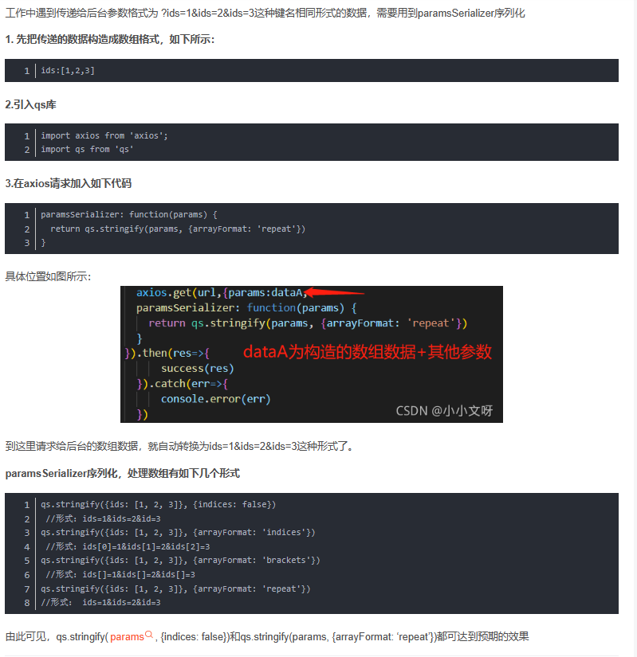
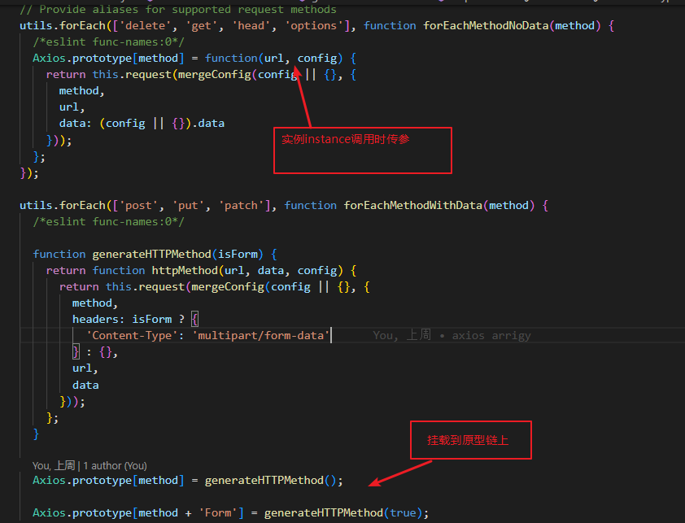
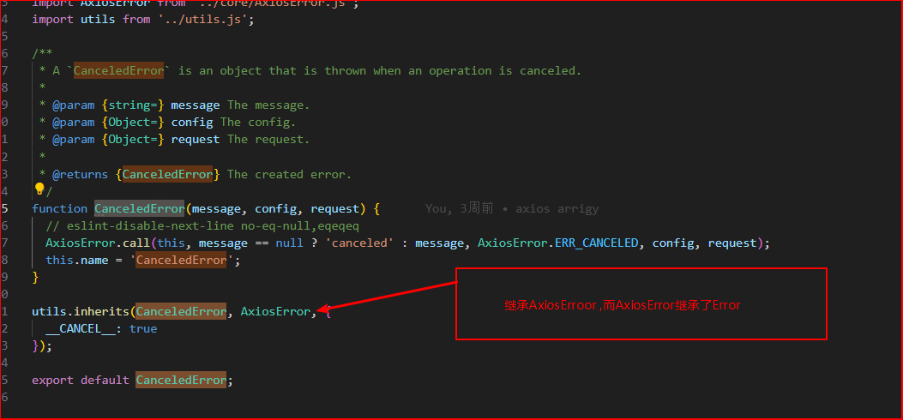
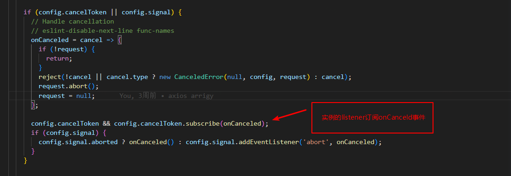

<h3 align='center'>关于axios源码学习的记录</h3>
<h4 align='right'>----2023-04</h4>

### 1.config配置项目

#### --- transformResponse / transformRequest
  在返回.then前/请求至服务器前修改返回值/传参值,这里注意下methods有限制,以及数组的最后一个function中return的data格式有限制
```js
const instance = axios.create({
    baseURL: '',
    timeout: 60000,
    headers: {
        'content-type': 'application/x-www-form-urlencoded',
        "token": ''
    },
    //修改respone的值,在.then之前
    transformResponse: [function (data) {
        data = 'hrs';
        return data
    }],

})
instance({
    url: '',
    method: 'post',
    data: {}
}).then(res => {
    console.log(res.data)    //    hrs
})
```
#### --- 参数序列化 paramsSerializer


#### ---onUploadProgress/onDownloadProgress
---

### 2.axios源码梳理
webpack链接： [webpack官网configuration](https://webpack.js.org/configuration/)
 
 **webapck.config.js返回config如下**


###### 在入口index.js中其引用 [lib/axios.js](./axios/lib/axios.js)文件，导出的值按照webpack.config.js配置被打包到了统一库(名字为axios)

#####类定义
-  [InterceptorManage](./axios/lib/core/InterceptorManager.js) 类
   - construction 
     construction函数     this.handler = [ ] 
   -  use   
   -  eject
   -  clear
   -  forEach       

- [Axios](./axios/lib/core/Axios.js) 类
   - request
   - getUri
在这个页面中：调用[utils.forEach](./axios/lib/utils.js)方法，在Axios的原型链上挂载了methods

- axios下的几个对象属性
   - cancel
     - CanceledError
       这里主要的是通过[util.inherits](./axios/lib/utils.js)方法，继承Error类
       
     - CancelToken
      关于CancelToken类的梳理
      在[axios.js](./axios/lib/axios.js)中当new Axios()时,其中[Axios](./axios/lib/core/Axios.js)类的request方法中调用了[dispatchRequest](./axios/lib/core/dispatchRequest.js),dispatchRequest调用了[adapter.getAdapter](./axios/lib/adapters/adapters.js),其又调用了[xhr.js](./axios/lib/adapters/xhr.js)方法：
      当请求取消时订阅所有的onCancel事件
      
       
     - isCancel


